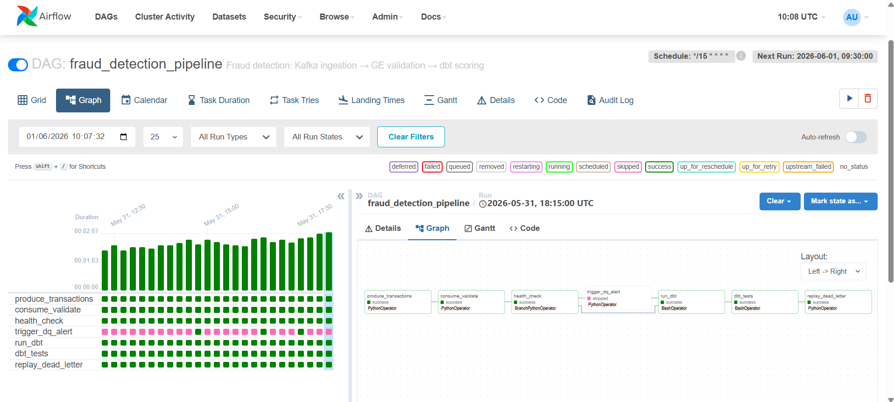
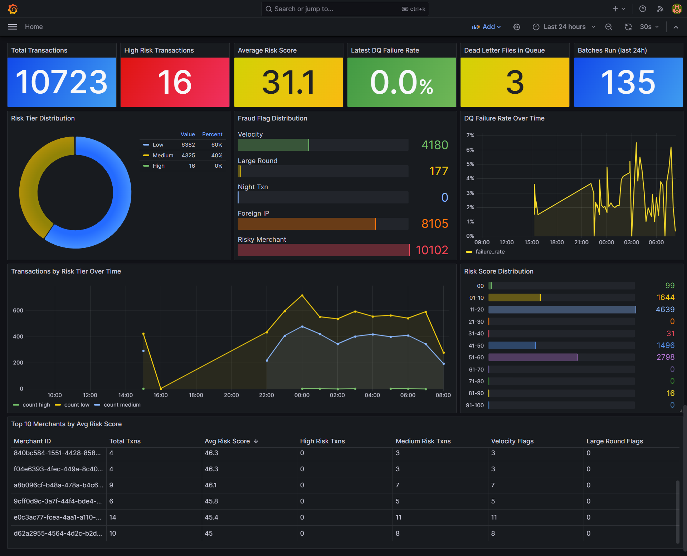

# Financial Fraud Detection Pipeline

A production-grade fraud detection data pipeline with real-time Kafka ingestion, Great Expectations data quality validation, dead-letter queuing with replay, retry handling, and dbt-powered fraud scoring — all orchestrated by Apache Airflow.

---

## Architecture

```
Transaction generator (Python)
    │  Realistic fraud patterns: velocity, large round amounts, night txns
    │  bad_data_pct drawn randomly 0–10% each run
    ▼
Apache Kafka — transactions topic (3 partitions)
    │  Event buffer, decouples producer from consumer
    ▼
Great Expectations — quality gate
    ├── Valid rows ──────────────────────────────────────────────┐
    └── Invalid rows → dead_letter/dq_failures_{ts}.json        │
                                                                 ▼
                                                    Retry handler (exponential backoff)
                                                         │  max 3 attempts: 2s → 4s → 8s
                                                         │  transient failures → pipeline_failure_{ts}.json
                                                         ▼
                                                 PostgreSQL raw.transactions
                                                         ▼
                                                 dbt — fraud signal model
                                                         │  velocity · large round amounts
                                                         │  night txns · foreign IP · merchant risk
                                                         ▼
                                              analytics.fct_fraud_signals
                                                         │  risk_score (0–100)
                                                         │  risk_tier (low / medium / high)
                                                         │  5 boolean flag columns
    ▼
Dead letter replay (end of every run)
    │  Re-validates dq_failures files — recovers any rows that now pass
    └── Processed files archived to dead_letter/replayed/

Airflow DAG — every 15 minutes
    produce → consume/validate → health_check
                                    ├── failure_rate > 5% → trigger_dq_alert (Slack) → run_dbt
                                    └── failure_rate ≤ 5% → run_dbt
                                                                  └── dbt_tests → replay_dead_letter
```



---

## Stack

| Layer | Technology |
|---|---|
| Message broker | Apache Kafka (Confluent 7.5) |
| Data quality | Great Expectations 0.18 |
| Orchestration | Apache Airflow 2.8 |
| Reliability | Exponential backoff, dead-letter queue + replay, health checks |
| Transformation | dbt-postgres 1.7 |
| Storage | PostgreSQL 15 |
| Alerting | Slack webhook (optional) |
| Containerisation | Docker Compose |

---

## Quick Start

**Prerequisites:** Docker Desktop

```bash
git clone https://github.com/yourname/fraud-detection-pipeline
cd fraud-detection-pipeline

# Create env file
cp .env.example .env          # edit SLACK_WEBHOOK_URL if you want Slack alerts

# Start everything
docker compose up -d

# Create the Kafka topic
docker exec fraud-detection-pipeline-kafka-1 \
  kafka-topics --create --bootstrap-server localhost:9092 \
  --replication-factor 1 --partitions 3 --topic transactions --if-not-exists

# Run the SQL schema (also auto-runs on first postgres start)
docker exec fraud-detection-pipeline-postgres-fraud-1 \
  psql -U fraud -d fraud_db -f /docker-entrypoint-initdb.d/01_create_raw_tables.sql
```

Airflow UI: `http://localhost:8080` — login: `admin` / `admin`

Unpause and trigger the DAG:
```bash
docker exec fraud-detection-pipeline-airflow-scheduler-1 \
  airflow dags unpause fraud_detection_pipeline

docker exec fraud-detection-pipeline-airflow-scheduler-1 \
  airflow dags trigger fraud_detection_pipeline
```

---

## Dashboard



Grafana monitors the live pipeline at `http://localhost:3000` (login: `admin` / your `GRAFANA_ADMIN_PASSWORD`). All 12 panels refresh every 30 seconds:

| Panel | What it shows |
|---|---|
| Total Transactions / High Risk / Avg Score / DQ Failure Rate | Live KPI stats |
| Risk Tier Distribution | Donut chart — low / medium / high breakdown |
| Fraud Flag Distribution | Bar gauge — counts per flag type |
| DQ Failure Rate Over Time | Time series — validation failure trend |
| Transactions by Risk Tier Over Time | Time series — volume by tier |
| Risk Score Distribution | Bar gauge — score bucket histogram |
| Top 10 Merchants by Avg Risk Score | Table with colour-coded risk scores |

---

## Slack Alerts

Add your webhook URL to `.env`, then restart the scheduler and webserver:

```bash
SLACK_WEBHOOK_URL=https://hooks.slack.com/services/YOUR/WEBHOOK/URL
```

```bash
docker compose restart airflow-scheduler airflow-webserver
```

When `failure_rate > 5%`, the `trigger_dq_alert` task fires and posts to Slack:

```
🚨 DQ ALERT — fraud_detection_pipeline
Run: manual__2026-05-31T...
Bad data produced: 7.3%
Validation failure rate: 6.1% (threshold: 5%)
Valid rows written: 187
Check dead_letter/ for rejected rows.
```

If `SLACK_WEBHOOK_URL` is not set, the alert logs prominently and continues — the pipeline never dies because of a notification failure.

---

## Key Concepts

### Great Expectations
GE defines *Expectations* — rules about your data. Before any row touches the database, GE tests it against these rules:
- `expect_column_values_to_not_be_null` on `id`, `reference`, `amount`
- `expect_column_values_to_be_between` on `amount` (0.01 to 50,000,000)
- `expect_column_values_to_be_in_set` on `currency`, `status`, `channel`
- `expect_column_values_to_be_unique` on `id`

Rows that fail any rule go to `dead_letter/` with a timestamp and full audit trail.

### Dead-letter queue and replay
Every invalid row is written to `dead_letter/dq_failures_{timestamp}.json`. Pipeline infrastructure failures go to `dead_letter/pipeline_failure_{timestamp}.json`.

At the end of every DAG run, `replay_dead_letter` re-validates the `dq_failures` files against the current GE rules. Rows that now pass (e.g. after a rule threshold change) are recovered and inserted into `raw.transactions`. All processed files are archived to `dead_letter/replayed/` so they are never double-processed.

### Retry with exponential backoff
The `@with_retry` decorator retries any decorated function up to 3 times. Delays: 2s → 4s → 8s. Applied to every database write. If all attempts fail, the error is logged to the dead-letter directory and re-raised.

### Random bad data percentage
Each pipeline run draws `bad_data_pct` uniformly from 0–10%. This means roughly half of all runs cross the 5% alert threshold, exercising both the clean path and the alert path automatically.

### Fraud signal rules

| Rule | Flag | Risk score |
|---|---|---|
| >10 txns from same customer in 60 min | `flag_velocity` | +35 |
| Amount ≥ ₦2M and divisible by 500,000 | `flag_large_round` | +30 |
| Transaction between midnight and 5am | `flag_night_txn` | +15 |
| IP country not Nigeria | `flag_foreign_ip` | +10 |
| Merchant fraud sim rate >20% | `flag_risky_merchant` | +10 |

Risk tiers: **high** ≥ 60 · **medium** ≥ 30 · **low** < 30

---

## Analytics queries

```sql
-- High-risk transactions
SELECT transaction_id, amount_ngn, risk_score, risk_tier,
       flag_velocity, flag_large_round, flag_night_txn
FROM analytics.fct_fraud_signals
WHERE risk_tier = 'high'
ORDER BY risk_score DESC;

-- DQ failure rate trend
SELECT DATE(created_at)      AS date,
       AVG(failure_rate)     AS avg_failure_rate,
       COUNT(*)              AS batches_run
FROM raw.dq_reports
GROUP BY 1 ORDER BY 1;

-- Top merchants by average risk score
SELECT merchant_id,
       COUNT(*)              AS txn_count,
       AVG(risk_score)       AS avg_risk_score,
       SUM(CASE WHEN risk_tier = 'high' THEN 1 ELSE 0 END) AS high_risk_count
FROM analytics.fct_fraud_signals
GROUP BY 1 ORDER BY avg_risk_score DESC LIMIT 20;

-- Dead letter audit
SELECT captured_at, record_count
FROM (
  SELECT (data->>'captured_at') AS captured_at,
         (data->>'record_count')::int AS record_count
  FROM (
    SELECT row_to_json(t) AS data
    FROM raw.dq_reports t
  ) sub
) summary
ORDER BY captured_at DESC LIMIT 10;
```

---

## Project Structure

```
fraud-detection-pipeline/
├── assets/
│   ├── fraud_detection_pipeline.png   # Architecture diagram
│   └── grafana_dashboard.png          # Live dashboard screenshot
├── dags/
│   └── fraud_pipeline_dag.py       # Airflow DAG — full pipeline
├── producer/
│   └── transaction_producer.py     # Kafka producer with fraud patterns
├── consumer/
│   ├── transaction_consumer.py     # Kafka consumer + GE validation
│   ├── retry_handler.py            # @with_retry decorator, PipelineHealthCheck
│   └── dead_letter_replay.py       # Reprocesses quarantined rows
├── validation/
│   └── ge_validator.py             # Great Expectations rules + dead-letter writer
├── dbt_project/
│   ├── dbt_project.yml
│   ├── profiles.yml
│   └── models/
│       ├── sources.yml             # raw.transactions source + input tests
│       └── marts/
│           ├── fct_fraud_signals.sql
│           └── schema.yml          # Output column tests (17 total)
├── sql/
│   └── 01_create_raw_tables.sql    # raw.transactions, raw.dq_reports, indexes
├── config/
│   └── settings.py
├── dead_letter/                    # Auto-created, git-ignored
│   └── replayed/                   # Archived after replay
├── docker-compose.yml
├── .env.example                    # Template — copy to .env and fill in values
└── .env                            # Local credentials — git-ignored
```

---

## Lessons Learned

- **Great Expectations row-level vs column-level**: GE validates at the column level (% of rows passing), not per-row. To route individual bad rows to dead-letter, build a pandas mask that mirrors the same rules — both layers need to stay in sync.
- **Kafka `enable_auto_commit=False`**: Always commit offsets manually after successful processing, not before. Auto-commit can mark messages as consumed before your DB write succeeds — losing data silently.
- **`@with_retry` decorator pattern**: Wrapping IO operations in a retry decorator keeps the business logic clean. The retry logic is defined once and reused everywhere.
- **BranchPythonOperator skips**: When a branch operator routes to one path, Airflow marks the other as `skipped` — not `failed`. Downstream tasks with `trigger_rule="all_done"` run regardless, which is how `replay_dead_letter` always fires.
- **dbt schema doubling**: Setting `+schema: analytics` in `dbt_project.yml` when your `profiles.yml` target schema is also `analytics` produces `analytics_analytics`. Either remove the model-level schema or use a `generate_schema_name` macro.

---

## Project Status

- [x] Kafka producer with realistic fraud patterns (random bad_data_pct 0–10%)
- [x] Great Expectations validation (7 expectation types)
- [x] Dead-letter queue for invalid rows
- [x] Dead-letter replay with archive (runs end of every DAG run)
- [x] Retry handler with exponential backoff
- [x] Pipeline health check with verbose logging
- [x] Slack webhook alerting (graceful fallback if not configured)
- [x] dbt fraud signal model (5 rules, composite risk score 0–100)
- [x] dbt source tests on raw.transactions (5 tests)
- [x] dbt output tests on fct_fraud_signals (12 tests)
- [x] Airflow DAG with BranchOperator — full pipeline end-to-end
